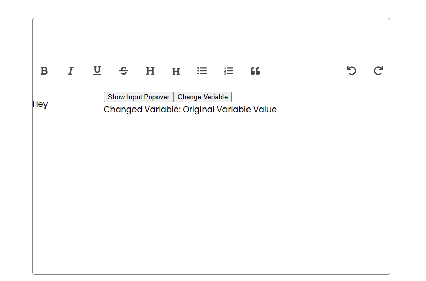
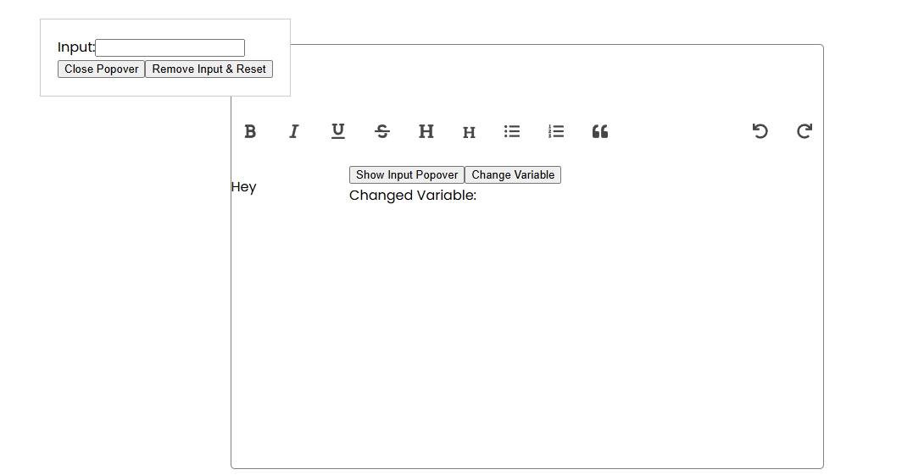
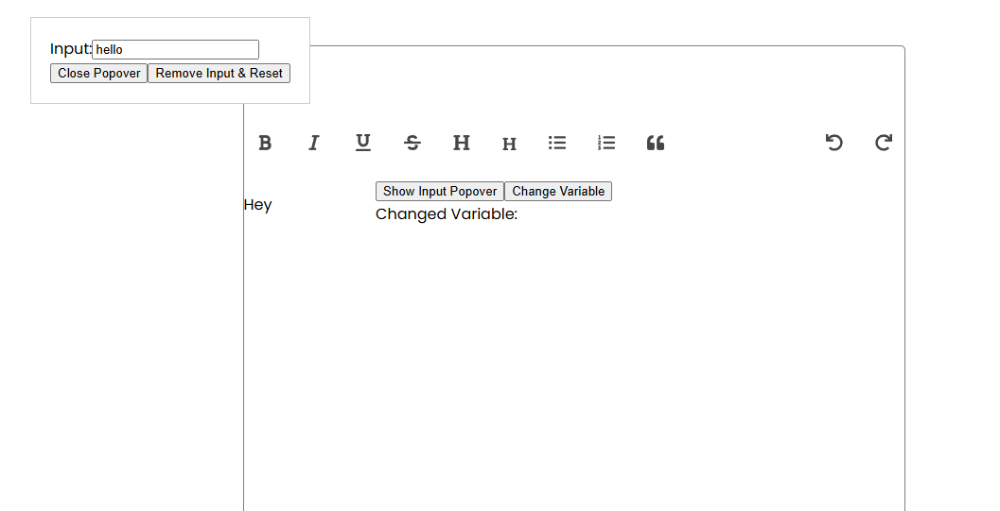
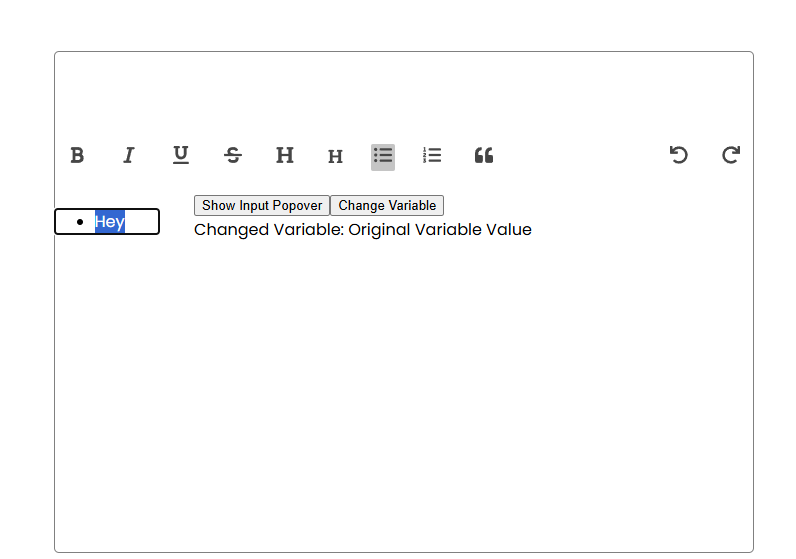
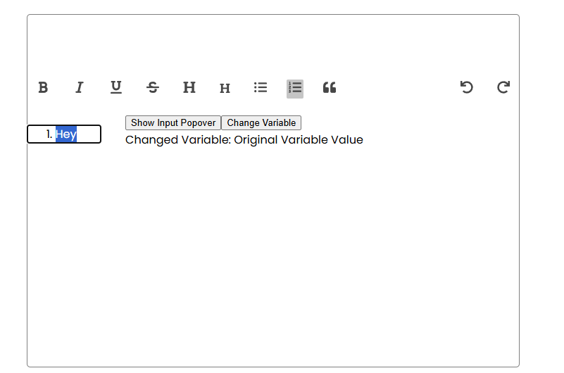
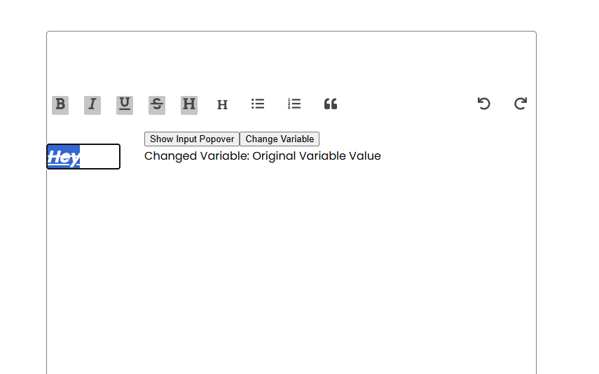

## TipTap Rich Text Editor

### Introduction 

Tiptap is a highly customizable, extensible, and modern rich-text editor. 
It offers a flexible API and a wide range of features, allowing developers to create tailored 
text-editing experiences for web applications with ease.

### Deployed URL 

### Screenshots

